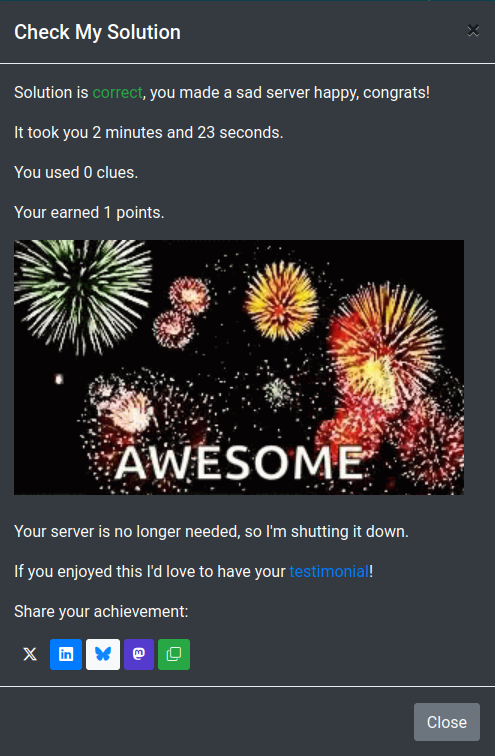

## Scenario: "Nuuk": More SSH Troubles

### Level: Easy

Description: (NOTE: if you are a Pro user, you cannot SSH directly into this VM; click the "Open the Server Terminal" button to use the web browser instead). 

### Test: You can ssh locally, i.e. ssh admin@127.0.0.1 works. 

Time to Solve: 10 minutes.

Root (sudo) Access: True

### Solution

The machine has a simple task, which is to SSH into localhost as admin, if we try the command listed above, we get the verification handshake, after saying `yes` we receive a connection refuse.

While being at the home of the username we try to go into the `.ssh` folder and see a permission denied message, after doing a `ls -la` we can see that the folder has no permissions and only shows the `d`

What the `d` stands for? -> https://unix.stackexchange.com/questions/59132/what-does-the-d-mean-in-ls-al-results-and-what-is-that-slot-called

Now which kind of permissions should this folder have? -> https://superuser.com/questions/215504/permissions-on-private-key-in-ssh-folder#215506

With this information we do a `chmod 700 .ssh` and after that we try again the `ssh admin@127.0.0.1` and this time it works ! :D

