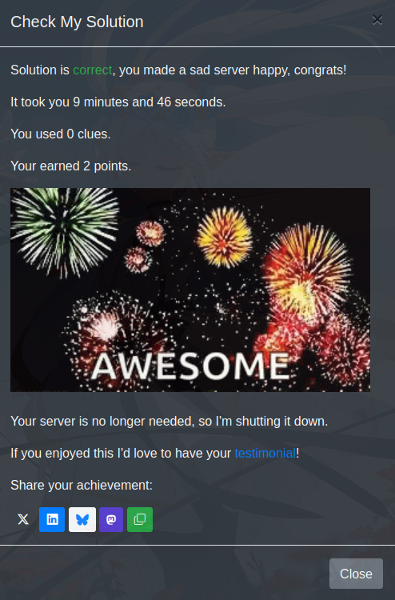

## Scenario: "Salta": Docker container won't start.

### Level: Medium

Description: There's a "dockerized" Node.js web application in the /home/admin/app directory. Create a Docker container so you get a web app on port :8888 and can curl to it. For the solution to be valid, there should be only one running Docker container.

### Test: curl localhost:8888 returns Hello World! from a running container.

Time to Solve: 15 minutes.

OS: Debian 11

`Root (sudo) Access: No`

### Solution

First I've entered the directory `/home/admin/app` to check if there was a Dockerfile, and indeed there was. I checked the Dockerfile and it was a simple Node.js application. There was a typo in the `CMD` and the `EXPOSE` was with the wrong port. I fixed the `CMD` to `node server.js` and changed the `EXPOSE` to `8888`. After that I built the image with the command:

```bash
$ docker build -t salta .
```

Then I ran the container with the command:

```bash
$ docker run -d -p 8888:8888 salta
```
After that I've noticed that there is a application running on port 8888, so I used the command:

```bash
sudo fuser -k 8888/tcp
```

To kill the process running on port 8888. After that I ran the container again with the command:

```bash
$ docker run -d -p 8888:8888 salta
```

Then I used the command:

```bash
$ curl localhost:8888
```

To check if the application was running and it returned `Hello World!` as expected.

### Completed challenge

