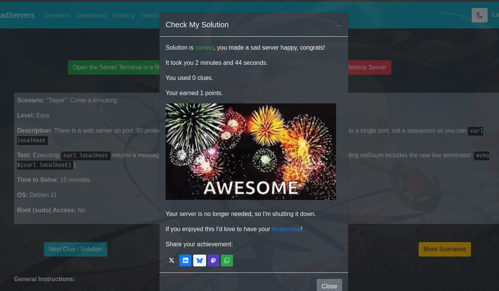

## Scenario: "Taipei": Come a-knocking

### Level: Easy

### Description 

There is a web server on port :80 protected with Port Knocking. Find the one "knock" needed (sending a SYN to a single port, not a sequence) so you can curl localhost.

### Test 

Executing curl localhost returns a message with md5sum fe474f8e1c29e9f412ed3b726369ab65. (Note: the resulting md5sum includes the new line terminator: echo $(curl localhost))

Time to Solve: 15 minutes.

OS: Debian 11

Root (sudo) Access: No

### Solution

Since the challenge is about port knocking, I've tried to find a clue in `/etc/knockd.conf` but since I got no access to it, I had to find another way.

The other way is to see if I can scan the ports and see if I can find any open ports. I've noticed that nmap is running on the server, so I can use it to scan the ports.

```bash
nmap localhost
```

Find that port `22` and `8080` is open, so I'll curl the localhost on port `8080` to see if I can get any response.

```bash
curl localhost:8080
```

Got a basic HTML, after that I've tried again to curl the localhost on port `80` and got a response.

```bash
curl localhost
## Who is there?
```

### Completed challenge

